**Completion status:** Kanto, Johto, Hoenn and the world hub each have **100% registered-map structural audit coverage**. Feature-completion percentages remain **unverified**; full campaign/post-game playthroughs are still required. [Verified scope and remaining checks](maintenance/final-pass/zone-status.md).

<div align="center">

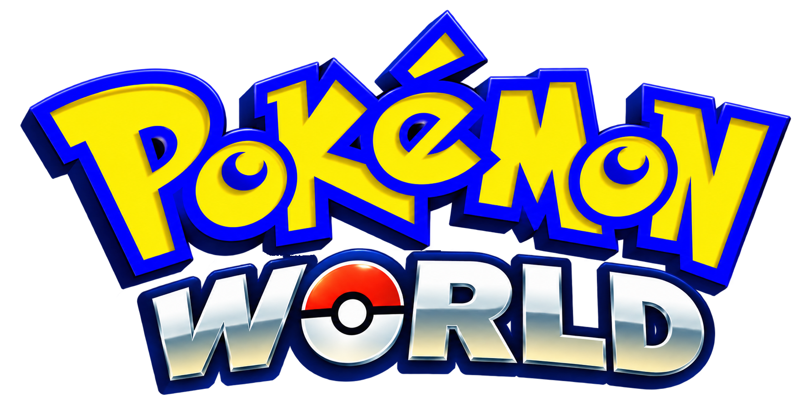

**Three regions. One connected adventure. One cartridge.**

A Game Boy Advance ROM hack built on
[pokeemerald-expansion](https://github.com/rh-hideout/pokeemerald-expansion).

[**Install**](INSTALL.md) · [**Features**](FEATURES.md) · [**Changelog**](CHANGELOG.md) · [**Credits**](CREDITS.md)

</div>

---

## What is it?

**Pokémon World** puts **Kanto**, **Johto** and **Hoenn** on one GBA cartridge. Each region has
its own story, 8 gyms, Elite Four and Champion — and you pick which to play
from a central **World Transit hub**.

Your **PC boxes, Pokédex, bag and money are shared** across all three, so the Pokémon you raise
travel with you. Badges, story flags and trainer defeats stay **per region**, so clearing Hoenn
doesn't hand you Johto's progress (or Johto's difficulty).

**Returning after a break?** Open **Story** from the Start menu, available from your first
normal menu in the hub or any region. Review Kanto, Johto and Hoenn without travelling:
status, regional badges, your current chapter, the next action and its destination,
prerequisites and last established milestone. Started optional errands have separate pages;
Champion campaigns keep their **Main story complete** status. [Controls and coverage](docs/story-progress/README.md).

The roster is **Generations 1–3 only**, family trees intact — later-gen evolutions of Gen 1–3
lines (Togekiss, Electivire, Weavile, Sylveon…) are kept and obtainable. All 339 Gen 4–9 families
are compiled out, and `make validate` fails if any wild table, gift or trainer party still
references one.

- **Engine:** pokeemerald-expansion 1.16.4 dev, untagged: upstream master `82598c4d88` (2026-08-23),
  past the 1.16.3 release (`include/constants/expansion.h`)
- **ROM:** `pokemonworld.gba` — title `POKEMON WRLD`, code `BPEE`

## Screenshots

Twenty native 240 × 160 mGBA screenshots. Scenes use disposable saves, debug warps
and synthetic teams/items; menu/battle fixtures invoke the production renderer.
Images are unretouched. [Capture methods and hashes](graphics/branding/screenshots/showcase/README.md).

| Title screen | World Transit hub |
|---|---|
| 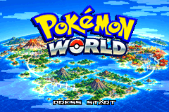 | 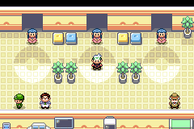 |

| Kanto — Viridian City | Kanto — Vermilion harbor |
|---|---|
| 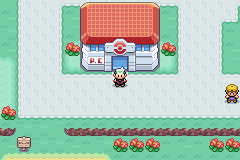 | 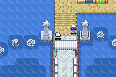 |

| Kanto — Celadon City | Johto — Cherrygrove City |
|---|---|
| 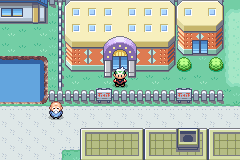 | 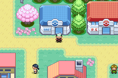 |

| Johto — Ecruteak City | Johto — Olivine lighthouse |
|---|---|
| 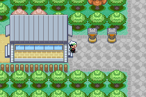 | 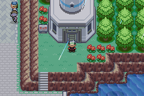 |

| Hoenn — Mossdeep City | Hoenn — Rustboro City |
|---|---|
| 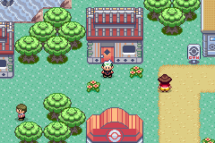 | 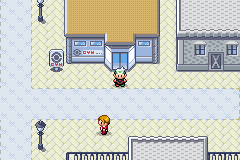 |

| Hoenn — Fortree City | Hoenn — Sootopolis City |
|---|---|
| 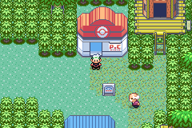 | 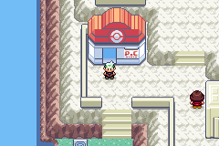 |

| Battle Frontier | Battle Net floor |
|---|---|
| 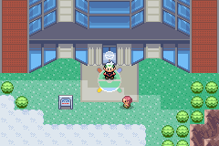 | 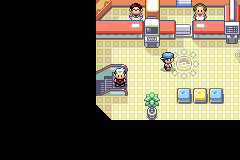 |

| Party and follower chooser | Bag |
|---|---|
| 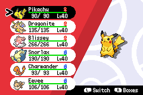 | 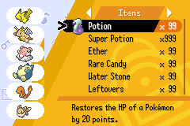 |

| Pokémon summary | DexNav on Route 101 |
|---|---|
| 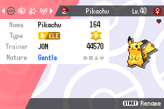 | 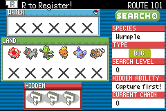 |

| Battle commands and BW healthboxes | World Panels Options |
|---|---|
| 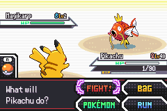 |  |

## Build it

You need devkitARM. The build is modern-toolchain only — agbcc is not used.

```sh
make modern -j8      # produces pokemonworld.gba
```

Full setup, toolchain notes and troubleshooting live in **[INSTALL.md](INSTALL.md)**.

| Command | What it does |
|---|---|
| `make modern` | Build the ROM (this is the normal build) |
| `make validate` | Host-side content checks — species, scripts, map events, layouts/warps/connections and encounters |
| `make check` | The inherited battle-engine test suite (5,700 cases, including explicit upstream skipped categories) |
| `test/overworld/run-all.sh` | 51 mandatory in-game overworld suites on a patched headless mGBA (52 with the optional owner save). Local only — see `test/overworld/mgba/README.md` |
| `make RELEASE=1` | Optimized build with the debug menu stripped |

CI (`.github/workflows/Check.yml`) runs the host validators and `make check`. It never uploads a
ROM, and the emulator suites can't run there.

## Status

**Last tagged release: v1.6** (2026-09-23). See the [changelog](CHANGELOG.md) for the full
entry. Save format is **v10**; v7 and newer migrate forward, anything older is refused.
Headline items since v1.5:

- A crowded overworld **skips a sprite it cannot fit** instead of crashing.
- **Victory Road, Seafoam Islands, Route 41, the Johto map marker, Bill's Eevee,
  the Dojo and Mt. Moon gifts, and the Rocket HQ multi battle** are fixed.
- The title screen is **Pokémon World**.

The v1.5 headlines, still in this build:

- The link-era features (Mystery Gift/Event, Union Room, record mixing, Cable Club) and the
  never-populated quest engine are **compiled out**.
- The Battle Net terminal moved into a **wall unit in all 50 Pokémon Center lobbies**, and the
  old Center 2Fs are sealed.
- The **S.S. Aqua actually lands in Kanto** — you disembark at the new Vermilion City port with
  your team intact.
- A long run of Johto script, trainer-data and save-migration fixes. v1.5 moved the save
  format to v9; v1.6 moves it to v10. Pre-v7 saves are still refused at load.
- **Whirlpool is implemented**, which unseals **Lugia** and the **Dragon's Den Shrine** — both
  were unreachable in every save, walled off by invisible blockers that no move could clear.
- **Wild encounters are flat**: every Pokémon is catchable at any hour. The clock still changes
  the light and which Pokémon roam the overworld, but no longer gates the grass.
- Johto's **music pass is finished** — its own cycling, surfing and trainer-approach themes, and
  the Radio Tower plays the occupation theme while Rocket holds it.
- Caught up with **upstream pokeemerald-expansion** (merged to their master of 2026-08-23).

The campaigns and their post-game scripts are implemented. The final pass verified all
1,190 registered map structures and passed 51 fresh emulator suites, including boot,
regional travel and targeted progression checks. **Full continuous campaign and post-game
playthroughs remain unverified**; source presence and targeted tests do not establish a
feature-complete percentage. Battle Net balance also needs full-length human playtesting.
See the [final-pass report](maintenance/final-pass/README.md) and
[per-zone verification limits](maintenance/final-pass/zone-status.md).

<details>
<summary><b>Region-by-region</b></summary>

<br>

- **Hoenn** — the native Emerald campaign, plus HARD Elite Four and Champion rematches. The
  Battle Frontier is the shared post-game facility, reachable from the hub once you've cleared
  any one region's league.
- **Johto** — ported in: 252 registered maps with tilesets, scripts and dedicated trainer rosters, wild tables,
  the Johto town map with Fly and heal locations, HGSS-style portraits for the gym leaders and
  Elite Four, and the post-game (Red at Mt. Silver, roaming beasts, the Celebi GS Ball chain,
  Ruins of Alph, the Bug-Catching Contest, Ho-Oh and Lugia).
- **Kanto** — the FireRed campaign wired in: real FRLG trainer parties, gym/Elite Four/Champion
  rosters, rival **GARY** (who is also the Kanto Champion), and the Route 23 badge gate.
- **Cross-region** — the World Transit hub, region switching, per-region access points, a
  three-page trainer card (L/R flips between Hoenn, Kanto and Johto badges), and six outfits.

</details>

<details>
<summary><b>Project layout</b></summary>

<br>

A decomp-style project — the ROM is reassembled from C source, assembly, JSON data and raw
assets, following pokeemerald / pokeemerald-expansion conventions.

| Path | Contents |
|---|---|
| `src/` · `include/` | Game and engine C source and headers. |
| `include/config/` | Feature-toggle headers — the first place to look to enable or tune a feature. |
| `data/` | Event/battle/field scripts, 1,190 registered maps (Hoenn + Kanto + ported Johto), `layouts/`, `tilesets/`, `text/`. |
| `graphics/` · `sound/` | Raw image and audio assets, converted to GBA formats at build time; branding and the screenshot gallery live in `graphics/branding/`. |
| `asm/` · `constants/` · `libagbsyscall/` | Hand-written assembly and macros, constant includes, GBA BIOS syscall library. |
| `tools/` | Build tools, compiled automatically by the Makefile. |
| `test/` | Battle-engine test suite (`make check`). |
| `test/overworld/` | This project's own checks: host validators (`Validate*.py`) and the Lua overworld suites. |

</details>

## Credits & license

Built on **pokeemerald-expansion** by the RH-Hideout team and its contributors, itself based on
[pokeemerald](https://github.com/pret/pokeemerald) by pret. See [CREDITS.md](CREDITS.md).

_Pokémon World is a free, non-commercial fan project. It is not affiliated with, endorsed by, or sponsored by Nintendo, Game Freak, or The Pokémon Company. No ROMs are distributed. You build the game from source using a legally obtained base ROM. It is not for sale or commercial use._

_All Pokémon names, characters, and related assets are the property of their respective owners. I claim no ownership or credit for any original work this project is based on. This project is provided as-is, with no warranty, and is used at your own risk._
