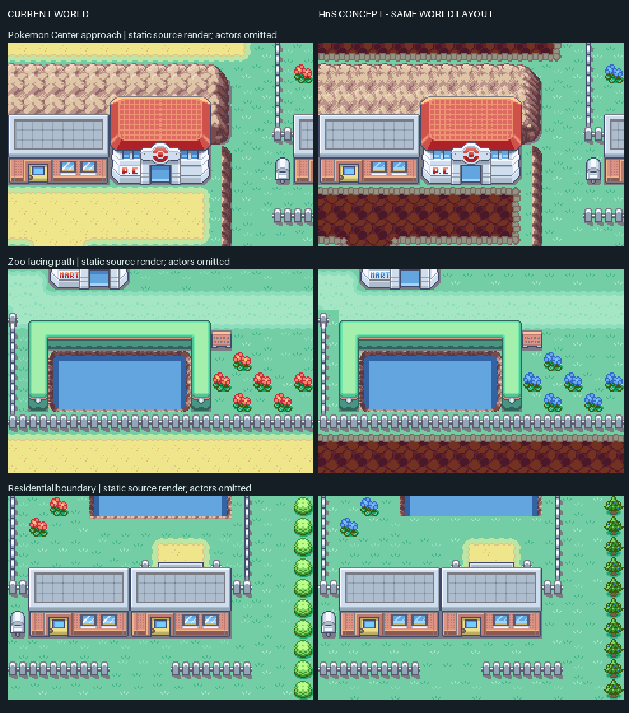

# Fuchsia City: Heart & Soul art comparison

**Recommendation: retain World’s current Fuchsia art direction.** The donor’s dark cobbled streets, blue flowers, and small conifers produce a different mood, but the buildings barely improve. The heavier path competes with the town’s landmarks, and the finer cliff texture adds visual noise. The blue flowers and conifers are useful references for later landscaping; this comparison does not justify a wholesale Fuchsia replacement. This is an art judgment based on the matched samples, not a claim that either project’s artwork is objectively better.

**[Open the two-minute comparison](index.html)** · [Single comparison sheet](images/comparison-sheet.png) · [Issue #331](https://github.com/evilchinesefood/PKMN-World/issues/331)

The only owner choice is **keep current / pursue the donor direction**. Keeping current completes the study without a production import. Pursuing the donor direction would lead to a separately scoped Fuchsia-only implementation proposal; it does not require the owner to identify tiles, assemble screenshots, or investigate compatibility.

## Matched samples



| View | Current World | Donor concept | Native camera origin |
| --- | --- | --- | --- |
| Pokémon Center approach | [240 × 160](images/01-pokemon-center-current.png) | [240 × 160](images/01-pokemon-center-donor.png) | Pixel (288, 400) |
| Zoo-facing path | [240 × 160](images/02-zoo-path-current.png) | [240 × 160](images/02-zoo-path-donor.png) | Pixel (112, 240) |
| Residential boundary | [240 × 160](images/03-residential-edge-current.png) | [240 × 160](images/03-residential-edge-donor.png) | Pixel (496, 400) |
| Full Fuchsia overview | [768 × 640](images/current-overview.png) | [768 × 640](images/donor-concept-overview.png) | Entire 48 × 40 map |

These are **native source-art renders, not emulator screenshots**. Both columns use the identical World map blocks and camera positions, daytime source palettes, and a fixed animation frame. Player/NPC/follower sprites, reflections, weather, dynamic lighting, animated doors, and runtime occlusion against actors are omitted equally. No AI-generated art, screenshot recoloring, map-script changes, or donor map geometry is involved.

The donor column deliberately retains World’s pond/shoreline art, zoo sand, the residential approach pad, and equivalent art that renders identically. It is a mixed concept, not a claim that the entire donor tileset drops into World unchanged. The concept shows 1,317 changed map cells and 107,800 changed pixels out of 491,520; many are small color differences rather than newly drawn objects.

## Pinned inputs and asset mapping

World baseline: [`45e1bf82ca5c2728910127863b926e627d4f18fc`](https://github.com/evilchinesefood/PKMN-World/tree/45e1bf82ca5c2728910127863b926e627d4f18fc). Donor: [`PokemonHnS-Development/pokehns-expansion` at `167aa6d537b109bb229c231ddce4616974c4da71`](https://github.com/PokemonHnS-Development/pokehns-expansion/tree/167aa6d537b109bb229c231ddce4616974c4da71). This is a complete game, not a stand-alone graphics package. Its README identifies the 1.15.1 expansion generation but also leaves a version-confirmation TODO; this is not proof of exact API compatibility with World’s 1.16.3-plus-development base. [Donor README](https://github.com/PokemonHnS-Development/pokehns-expansion/blob/167aa6d537b109bb229c231ddce4616974c4da71/README.md)

World’s `FuchsiaCity_Frlg` resolves to `gTileset_General_Frlg` and `gTileset_FuchsiaCity`. The donor reference map `FuchsiaCity_hns` resolves to `gTileset_Kanto_General_Hns` and `gTileset_Fuchsia_Hns`. Donor source directories are [primary `kanto_general_hns`](https://github.com/PokemonHnS-Development/pokehns-expansion/tree/167aa6d537b109bb229c231ddce4616974c4da71/data/tilesets/primary/kanto_general_hns) and [secondary `fuchsia_hns`](https://github.com/PokemonHnS-Development/pokehns-expansion/tree/167aa6d537b109bb229c231ddce4616974c4da71/data/tilesets/secondary/fuchsia_hns). Each contributes `tiles.png`, `metatiles.bin`, `metatile_attributes.bin`, and `palettes/*.pal`; exact file hashes are in [donor-manifest.json](donor-manifest.json).

The primary sheet’s latest file-history change at the pinned revision was **May 22, 2026**, the Kanto makeover commit. An earlier May 21 commit explicitly began from Johto general art. These commits establish integration history, not the authorship of every pixel. [Kanto makeover commit](https://github.com/PokemonHnS-Development/pokehns-expansion/commit/d89cc46ea47a6a6849e5a1b9cd0daf112c044ecc), [Johto-based replacement commit](https://github.com/PokemonHnS-Development/pokehns-expansion/commit/af2f6ed5713d673df25ecd4d97a8f4442ead1ed5), [compact provenance record](provenance.json)

All **232 used World metatiles** have an explicit entry in [mapping.json](mapping.json), including donor IDs and retained-art reasons. [cell-mapping.json](cell-mapping.json) expands this to all 1,920 World map cells. Important examples:

| Art role | World → donor selection | Result and retained areas |
| --- | --- | --- |
| Ground / pale footpaths | Explicit grass family; `0x010 → 0x000`, `0x011 → 0x001` | Subtle changes in grass colors and stippling; walking geometry unchanged. |
| Main yellow street | `0x0D3/0D4/0D5 → 0x350/351/352`, other edges/corners individually mapped | Dark cobbles with a gray edge. World uses the same sand IDs in animal pens, so four pen interiors and one house approach are explicitly retained: 45 cells total. |
| Tree canopy / trunk | `0x016/017/026/027 → 0x012/013/022/023`; remaining family explicitly listed | Fits existing footprints; no additional tree obstacles. |
| Flowers / small blocking shrub | `0x004 → 0x004`, `0x005 → 0x005` | Red flowers become blue; round shrubs become small conifers. Equal IDs are verified art matches, not an assumption of equal semantics. |
| Cliff | Explicit used members of `0x068–0x0B1` | Finer rock texture in the existing footprint. |
| Fence / sign | Individual mappings including `0x168 → 0x36F` | Retain fence and sign coordinates; visual colors/details vary. |
| Roof / façade | Individual matches, including `0x028 → 0x17C` | Donor Pokémon Center/Mart families are remapped; most town-specific homes are retained where already identical. |
| Zoo enclosure | World secondary wall family retained | The compared donor equivalents are already identical. |
| Pond / shoreline | World water/shoreline family retained | No complete matching donor edge/animation family was established for these exact World footprints; do not substitute visually incomplete edges. |

**54 of the 123 selected donor metatiles already have pixel-exact static matches in World’s existing Johto art.** The scan covers the tilesets used by Cherrygrove, New Bark, Violet, Goldenrod, and National Park, not every asset in the repository. The detailed matches identify actual World metatile IDs and tilesets in [existing-asset-matches.json](existing-asset-matches.json). Reusing an existing World equivalent avoids importing a second copy; a static match does not establish a donor asset’s original author or guarantee the same runtime animation.

## Compatibility and budget findings

| Source inventory | Current World Fuchsia | Donor Fuchsia pair |
| --- | ---: | ---: |
| Primary 8 × 8 tiles | 640 | 640 |
| Secondary 8 × 8 tiles | 192 | 384 |
| Combined sheet tiles | 832 | 1,024 |
| Primary / secondary metatiles | 640 / 192 | 640 / 280 |
| Metatile attribute width | u32 / u32 | u16 / u16 |
| Loaded primary / secondary palette banks | 7 / 6 | 7 / 6 |

The donor sheet pair occupies the full 1,024 tile-ID range, 192 tiles more than World’s pair: 6 KiB more uncompressed 4bpp tile data. That is a whole-sheet comparison, **not the required addition for this concept**. The mixed rendered concept selects 172 World tile IDs and 248 donor tile IDs, yielding 339 distinct indexed bitmaps before any tile/palette remapping. Its selected source colors form **14 distinct, unmerged palette rows**, excluding transparent entry zero, against 13 banks loaded by World. Fourteen is not a proven minimum: unused colors can be packed or recolored. It does prove that the concept is not a ready-made palette assignment. Inventory and per-source banks are in [measurements.json](measurements.json).

There are five concrete integration boundaries:

1. **Shared primary / connections.** `gTileset_General_Frlg` serves 180 layouts. A global sheet edit changes other Kanto maps. A Fuchsia-only tileset pair must also preserve the visible seams and loaded-tile assumptions at Route 15, Route 18, and Route 19 connections; making a private primary alone does not prove seamless scrolling works. [World map](https://github.com/evilchinesefood/PKMN-World/blob/45e1bf82ca5c2728910127863b926e627d4f18fc/data/maps/FuchsiaCity_Frlg/map.json), [layouts](https://github.com/evilchinesefood/PKMN-World/blob/45e1bf82ca5c2728910127863b926e627d4f18fc/data/layouts/layouts.json)
2. **Attributes / behavior.** Preserve World’s collision, elevation, metatile behaviors, and layer types by role. Do not copy donor u16 attributes onto World’s u32 FRLG records. The preview only substitutes composed art; it does not validate surfing, Cut, ledges, warps, reflection behaviors, or actor occlusion. [World tileset headers](https://github.com/evilchinesefood/PKMN-World/blob/45e1bf82ca5c2728910127863b926e627d4f18fc/src/data/tilesets/headers.h), [donor headers](https://github.com/PokemonHnS-Development/pokehns-expansion/blob/167aa6d537b109bb229c231ddce4616974c4da71/src/data/tilesets/headers.h)
3. **Animation residency.** World’s FRLG callback writes land-water tiles 416–463, sand-water 464–481, and flowers 508–511. Donor Kanto actually uses `InitTilesetAnim_JohtoGeneral`, which reads animation files from `primary/johto_general_hns/anim/`: sand-water 416–433, waterfall 450–461, and flowers 508–511. Its land-water queue immediately returns. Those ranges differ; copying World’s callback with donor pixels corrupts art. The renderer applies the actual frame-zero assignments. [World animation code](https://github.com/evilchinesefood/PKMN-World/blob/45e1bf82ca5c2728910127863b926e627d4f18fc/src/tileset_anims.c), [donor animation code](https://github.com/PokemonHnS-Development/pokehns-expansion/blob/167aa6d537b109bb229c231ddce4616974c4da71/src/tileset_anims.c)
4. **Doors.** Lookup keys include metatile ID and tileset pointer. World uses general FRLG entries plus `fuchsia.png` / Fuchsia bank 8; donor Kanto dispatches Johto doors and donor Fuchsia uses `fuchsia_hns` / bank 8 plus a separate red-door bank 9. An apparently unchanged closed door does not prove its animation is compatible after rebanking. Reuse World’s doors where practical, and explicitly register any private tileset identity. Door frames are outside this study’s visual samples. [World door table](https://github.com/evilchinesefood/PKMN-World/blob/45e1bf82ca5c2728910127863b926e627d4f18fc/src/field_door.c), [donor door table](https://github.com/PokemonHnS-Development/pokehns-expansion/blob/167aa6d537b109bb229c231ddce4616974c4da71/src/field_door.c)
5. **Lighting / followers / overworld encounters.** New palette rows must retain World’s day/night handling, light metadata, and 7-primary/6-secondary indexing. Keep World’s weather, followers, wild-overworld placement rules, and existing map callbacks. The preview uses daytime RGB only; source art provides no assurance about dusk, lit windows, sprite contrast, reflection layers, or follower visibility. [World palette loader](https://github.com/evilchinesefood/PKMN-World/blob/45e1bf82ca5c2728910127863b926e627d4f18fc/src/fieldmap.c), [lighting code](https://github.com/evilchinesefood/PKMN-World/blob/45e1bf82ca5c2728910127863b926e627d4f18fc/src/palette.c)

## Attribution and reuse disposition

The donor README requests Heart & Soul credit, retention of upstream credit chains, and explicit RHH/version credit when using an updated expansion. Its pinned tree has **no root LICENSE/COPYING file**, and the reviewed sources do not establish individual asset licenses. The authoritative tileset credit roll names **Crystal Advance / Kertra, Ekat99, TheDeadHeroAlistair, Johto Redrawn Team, zatavares852, lbsbezerra, WesleyFG, and Kalarie**. It does not map those names to each source pixel family. [Pinned reuse request](https://github.com/PokemonHnS-Development/pokehns-expansion/blob/167aa6d537b109bb229c231ddce4616974c4da71/README.md), [pinned credit-roll source](https://github.com/PokemonHnS-Development/pokehns-expansion/blob/167aa6d537b109bb229c231ddce4616974c4da71/src/data/credits_hns.h), [official rendered credits](https://pokemonhns-development.github.io/pokehns-expansion-documentation/credits.html)

| Candidate family | Exact source family at pinned donor revision | Identified credit / applicable statement | Production disposition |
| --- | --- | --- | --- |
| Grass, paths, trees, flowers, cliff, general fence/sign, Center/Mart | `primary/kanto_general_hns/{tiles.png,metatiles.bin,palettes/*.pal}` | Project-wide tileset chain above; README credit request. Individual artists and terms for these families remain **unknown**. | Exclude new external pixels until asset-specific provenance/reuse is resolved; prefer an exact existing World match where available. |
| Cobbled street and town-specific building details | `secondary/fuchsia_hns/{tiles.png,metatiles.bin,palettes/*.pal}` | Same project-wide chain; no per-family permission found. | Exclude from production pending resolution. |
| Animation support for donor Kanto | `primary/johto_general_hns/anim/{flower,sandwatersedge,water_current_landwatersedge}/0.png` in these samples | Same project-wide chain; no individual animation permission established. | Reference only; a future port needs the complete animation family and its terms. |
| Existing World ponds, enclosures, equivalent homes, and matched Johto art | Existing World files and IDs recorded in the mapping/match manifests | Preserve World’s existing attribution chain; matching pixels do not newly establish external permission. | No donor import required. Still validate World’s palette/behavior integration if reassigned. |

The report and derived comparison images attribute their source for review. **No donor source sheets, game code, map binaries, or scripts are imported into production.** The source cache is outside the repository; only small study renders, manifests, and reproduction tools are deliverables. No artists were contacted. Unknown permission remains an explicit exclusion rather than an assumption that a credit list grants reuse rights.

## Bounded plan if the donor direction is selected later

Estimated implementation effort: **4–7 working days after the selected asset families are cleared for reuse**, excluding any external permission response time. This is an engineering estimate, not a measured delivery commitment.

1. Freeze the approved family subset and resolve new-art provenance; retain or substitute existing World pixels for unresolved families. Keep the 45 semantic exceptions and all actor/warp coordinates.
2. Pack only the selected art into a private Fuchsia tileset pair with a measured 640/384 tile split, 7/6 palette split, and explicit animation reservations. Preserve existing metatile IDs/World behaviors where possible; if renumbering is necessary, remap only Fuchsia’s low metatile bits and preserve collision/elevation bits. Validate connected-map rendering before proceeding.
3. Add only necessary private header/graphics/metatile/door/animation registrations. Preserve World’s lighting and field-task systems; do not merge the donor engine or upgrade expansion. Target files would be the Fuchsia tileset directories, tileset registration files, Fuchsia layout definition, and narrowly scoped door/animation mappings.
4. Run `Testing/ValidateMapEvents.py` and `Testing/ValidateOwMonPlacements.py`; extend an emulator capture fixture for these three Fuchsia camera positions at day/dusk/night/dawn. Use `DayNightTint.lua` and `DayNightCrossingProbe.lua` for lighting, `OwMonSprites.lua` and `FollowerOutdoors.lua` for encounter/follower regressions. These existing suites do not replace a Fuchsia-specific tour: enter/exit every exterior door, traverse Routes 15/18/19 boundaries, surf applicable water edges, inspect Cut/ledge behavior, and capture wet-weather/reflection scenes.
5. Require equal route/warp behavior, no tile/palette tearing, correct actor occlusion, and clean day/night transitions. Keep the one-town art change in a separate revertible commit. Reverting that commit should restore original tileset references/art without changing save formats or saved story state.

Remaining decisions are itemized and bounded: whether the owner prefers the donor mood; which new-art families have permission; which palette packing/recoloring preserves that approved look; and how a private Fuchsia set preserves shared connection seams. The agent owns resolving the latter three if a port is later authorized. No new implementation issue is created by this study.

## Reproduction and verification

The renderer decodes indexed PNGs into tile-order pixels, reads JASC palettes at GBA 5-bit color precision, decodes flip/palette bits in each 8 × 8 tile descriptor, composes 16 × 16 metatile layers, and applies the callback’s static frame-zero assignments. It supports the observed World u32 and donor u16 metatile attributes. Dependencies are Python 3 and Pillow; the saved contact sheet was built with Pillow **12.3.0**. No emulator or ROM build is needed to reproduce this research artifact.

Run from the World checkout; use the pinned World baseline for identical results:

```sh
python3 Testing/visual-studies/hns/fetch_donor.py --cache /tmp/pkmn-world-hns-source
python3 Testing/visual-studies/hns/build_comparison.py --donor /tmp/pkmn-world-hns-source
python3 Testing/visual-studies/hns/find_existing_matches.py --donor /tmp/pkmn-world-hns-source
python3 Testing/visual-studies/hns/verify_study.py --donor /tmp/pkmn-world-hns-source
```

The fetcher retrieves the pinned 123 source files and checks Git blob SHA-1 plus SHA-256; it rejects a cache inside the World repository. [world-input-manifest.json](world-input-manifest.json) pins 177 local render/matching inputs, verified against the baseline Git objects; flagged palette text files normalize checkout CRLF to LF before hashing. [verification.json](verification.json) records a successful verification of all 300 inputs, complete 232-metatile coverage, all 1,920 unchanged World cell references, exact 240 × 160 crops, all 45 retained context cells, and byte-identical regeneration of all nine PNGs plus the measurement/cell manifests. Both full overviews and the final comparison sheet were visually inspected for seams and incorrect semantic substitutions.

This validation supports the fidelity and repeatability of the comparison. It does not claim a hardware-fitting ROM port, runtime animation correctness after an import, or established artwork reuse permission.
