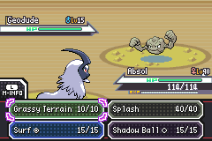
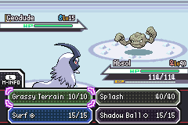
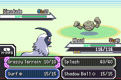
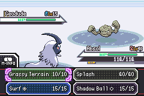
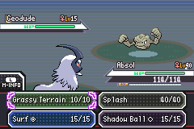

# Location and time battle presentation (#327)

Ice Path reuses the cave artwork with colors from `cave_ice/palettes/08.pal`.
Ordinary land battles on snowy Mt. Silver reuse rock artwork and its entrance,
with colors from `mt_silver_snow/palettes/08.pal`. `palette-sources.json` records
every derived color. No external graphics, map types or metatile behaviors change.

`ResolveBattlePresentation` chooses a complete visual bundle independently of
`gBattleEnvironment`. Initial battle setup captures the existing overworld blend;
restoration always derives colors from the authored palette and that snapshot.
Only BG palettes 2–4 are loaded. Special scenes preserve their prior selection.
Terrain move backgrounds keep precedence. Battle cleanup and both evolution
loaders clear the snapshot.

Testing also exposed a baseline crash: Bag/Party returns allocated windows ahead
of the animation buffers. The resulting fragmentation left a 10,844-byte maximum
free block for a 13,024-byte Grassy Terrain decompression request. Restoring the
initial allocation order in `reshow_battle_screen.c` fixes that path without
increasing the heap or retaining menu allocations.

## Reproduction

Use a matching ROM and ELF. The fixture compiler attaches test-only commands to
verified unused space in a disposable ROM; it never patches the delivered game.
The same fixture source works against the merged BW baseline and this feature.

```sh
make modern TOOLCHAIN=/opt/devkitpro/devkitARM -j8
make check TOOLCHAIN=/opt/devkitpro/devkitARM -j8
python3 test/overworld/battle-palettes/build_fixture.py \
  --repo "$PWD" --rom pokemonworld.gba --elf pokemonworld.elf \
  --out /tmp/world-palettes-fixture
python3 test/overworld/visual-features/run_fixture.py \
  --repo "$PWD" --fixture /tmp/world-palettes-fixture \
  --suite test/overworld/battle-palettes/restoration.lua --out /tmp/world-palettes-restoration
```

Suites:

- `capture.lua`: real map selection on all five Ice Path floors, snow/summit,
  Granite Cave, Hoenn/Johto/Kanto day and night, morning/evening, and white/dark/shiny
  Pokémon. Logs environment, battlefield, UI and OBJ palettes for matched comparison.
- `restoration.lua`: entry snapshot, clock changes, Bag/Party, actual Grassy Terrain
  activation/expiry, Shadow Ball background restoration, and loader palette ownership.
- `menu_memory.lua`: three Bag/Party cycles and an actual terrain move; fails with
  an allocation crash on the merged baseline and measures contiguous free memory.
- `entry_evolution.lua`: recorded cave/rock/night entrances and an actual evolution
  after deliberately priming a stale snow snapshot.
- `save.lua`: creates a synthetic Ice Path save, reloads it and checks normal walking.

`test/battle_presentation.c` checks resolution, exclusions, complete fallbacks,
immutable day palettes and frozen time inputs. The battle-engine Nature Power,
Secret Power and Camouflage cases verify gameplay separately from screenshot tests.

Run the existing BW suites against this fixture with
`test/overworld/bw-battle-ui/run_all.py`; run tracked game suites with `test/overworld/run-all.sh`.
Development and release configurations are build checks. Per `RELEASING.md`, the
owner package uses the tested development ROM, distributed locally, without the
fixture hook. No ROM or personal save is committed or uploaded to GitHub.

## Review evidence

[Validation and delivery identifiers](evidence/validation.md) ·
[Code review](evidence/code-review.md) ·
[Interactive gallery source](review/index.html)

| Scene | Before | After |
|---|---|---|
| Ice Path |  |  |
| Snowy Mt. Silver |  |  |
| Night on Route 101 |  |  |

[Snow entrance](review/media/snow_entry.webp) ·
[Terrain expires normally](review/media/splash_4.webp) ·
[Shadow Ball restores the night palette](review/media/shadow_ball.webp)

Generate the gallery from retained run directories with:

```sh
python3 test/overworld/battle-palettes/render_review.py \
  --before /tmp/pkmn-world-327-before-final \
  --after /tmp/pkmn-world-327-final --out test/overworld/battle-palettes/review \
  --before-source 4bea54bfffd2ea73fcea7c34a4c36fede7cdceb2 \
  --after-source 05b37db1a9b1dd8efda95233e4a61822680bba7b
```

Both source labels are required: use the revisions that produced the selected
captures, not the current checkout. The generator escapes them in the page and
records them in `capture-sources.json`.
