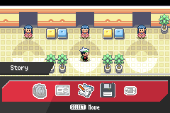
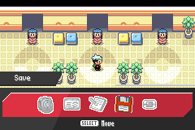
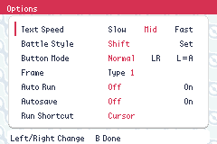

# Menu responsiveness and icons

Local main-menu actions no longer probe absent wireless hardware before fading or entering their destination. The optional Mystery Gift/e-Reader actions still check the adapter. Options and Story footer panels now have transparent rounded corners. Story uses the previous paper-and-pencil Save artwork; Save uses a floppy disk with inactive and selected frames in the existing palette.

| Story icon | Save icon | Rounded footer |
| --- | --- | --- |
|  |  |  |

[Story footer](evidence/story.png). Screenshots are native emulator output from disposable synthetic fixtures.

## Reproduce

```sh
make modern TOOLCHAIN=/opt/devkitpro/devkitARM -j8
python3 test/overworld/menu-polish/run.py --out /tmp/pw-menu-polish
```

The runner builds an isolated fixture from the matching ROM/ELF and boots a fresh game for each scenario; no personal save is used. It measures emulated frames from A to palette movement and the expected destination callback, and checks footer corner pixels after redraws. It also captures both icons and checks return to the field.

| Choice | Before: fade / destination frames | After: fade / destination frames |
| --- | --- | --- |
| Continue | 36 / 92 | 2 / 23 |
| New Game | 35 / 91 | 2 / 23 |
| Options | 34 / 90 | 2 / 23 |

Baseline: `4303e6ddcb`; all three baseline latency checks failed. After: 12/12 transition checks and 12/12 footer/navigation checks passed. These measure destination callback entry, not completion of every destination's startup animation. Optional wireless hardware paths were reviewed by inspection; they are disabled in the shipped build.

Additional verification: `make validate`, the existing Story renderer fixture (22/22), and production Story tests (31/31, including save/Continue).
