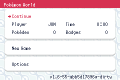
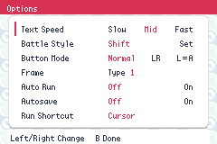
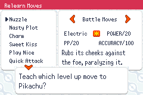

# World Panels menu review

Selected design A applies to Main Menu, Options and Relearn Moves. It reuses the PC box background tiles and half-pixel diagonal movement with light colors, white panels and red headers. The Main Menu uses dark save details, mixed-case labels and a red selection marker; its rounded panel borders no longer overlap.

| Main Menu | Options | Relearn Moves |
| --- | --- | --- |
|  |  |  |

[Main Menu before/after](evidence/comparison.png) · [Main animation](evidence/main.webp) · [Options animation](evidence/options.webp) · [Relearning animation](evidence/relearn.webp)

Battle Commands retain their original uppercase labels and font. Battle Move Selection, specialty-screen styling and Stats/IV/EV behavior are outside this change. Other text-rendered action labels use title case.

## Validation

Development build succeeds. Initial implementation: 16/16 emulator checks and 9/9 rendered-motion checks. Main Menu refinement: 4/4 emulator checks and 3/3 rendered-motion checks. Checks cover selecting entries, returning from Options, no-save boot, lower settings/frame preview, relearning confirmation/cancel/contest details, battle return, scrolling backgrounds and stationary foregrounds. Screenshots use synthetic data and isolated ROM/save copies; no personal save is used. This is targeted verification, not exhaustive state coverage.

[Capture hashes and results](manifest.json). Images are native, unretouched emulator output; WebP files encode 32 frames captured at two-frame intervals.

## Reproduce

Build `make modern TOOLCHAIN=/opt/devkitpro/devkitARM -j8`. Build the extra fixture with `test/overworld/visual-features/build_fixture.py --repo "$PWD" --rom "$PWD/pokemonworld.gba" --elf "$PWD/pokemonworld.elf" --out /tmp/world-menu-fixture --source "$PWD/test/overworld/world-menu-theme/fixture.c"`, then run `python3 test/overworld/swsh-refresh/export_symbols.py pokemonworld.elf /tmp/world-menu-fixture`.

Use `test/overworld/visual-features/run_fixture.py` with `--fixture /tmp/world-menu-fixture --suite test/overworld/world-menu-theme/capture-world.lua --out /tmp/world-menu-captures`, `--repo "$PWD"`, and `PW_UI_MODE=38` for Main Menu or `37` for relearning. The runner needs `mgba-headless`; `MGBA_HEADLESS` can supply its path. Boot uses the same fixture and `capture-boot.lua`. Options uses the standard visual-features fixture with `capture-options.lua`; battle uses the swsh-refresh fixture with `capture-battle.lua`.
